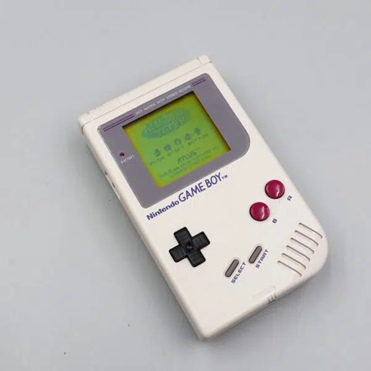
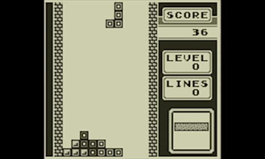
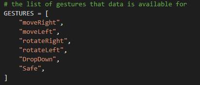
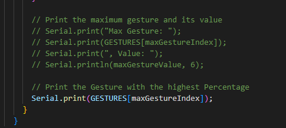

# TetrisArduino
Am 21. April 1989 wurde in Japan der erste Gameboy veröffentlicht. Damals wurde der Gameboy auch nur zusammen mit dem Spiel TETRIS angeboten. Das führte dazu, dass bis heute TETRIS das meistverkaufte Spiel ist. 

Allerdings war TETRIS, obwohl es nur schwarz-weiß war in den neunziger Jahren unglaublich beliebt. 

Heutzutage spielen nur noch sehr wenige Kinder TETRIS. Deshalb haben wir uns überlegt, TETRIS zu updaten um es wieder attraktiver werden zu lassen. Unsere Idee war, TETRIS über Handbewegungen mit einem Arduino Nano 33 BLE Sense zu steuern. Wie das genau aussehen soll, ist in dem folgenden Video zu sehen. 

## Gliederung
1. Vorbereitung der Arduino IDE
2. Planung Bewegung
3. Bewegungen aufnehmen
4. Bewegungsdaten trainieren 
5. Bewegungserkennung
6. Tastenzuweisung
7. Trouble Shooting

<!--   -->

## 1. Vorbereitung der Arduino IDE
Das Projekt wurde mit einem [Arduino Nano 33 BLE Sense](https://docs.arduino.cc/hardware/nano-33-ble-sense) durchgeführt.
Bevor mit dem Projekt begonnen werden kann, muss jedoch zunächst die Arduino IDE heruntergeladen und eingerichtet werden.

Dafür folgen Sie einfach den nachfolgenden Schritten:
- Downloaden und installieren Sie die Arduino IDE [hier](https://arduino.cc/downloads)
- Öffnen Sie die soeben installierte IDE
- Board Manager öffnen (Tools > Board > Boards Manager...)
- Suchen und installieren Sie "Nano BLE" 
- Die Installation kann mehrere Minuten in Anspruch nehmen
- Nach Abschluss der Installation kann das Boards Manager Fenster geschlossen werden
- Nun navigieren Sie zu Library Manager (Tools > Manage Libraries...)
- Suchen und installieren Sie die "Arduino_TensorFlowLite" Bibliothek
- Suchen und installieren Sie die "Arduino_LSM9DS1" Bibliothek
- Als nächstes können Sie ihr Arduino Board mithilfe von einem Micro USB Kabel mit Ihrem Computer verbinden
- Wählen Sie das Board (Tools > Board > Arduino 33 BLE)
- Wählen Sie den Port (Tools > Port > COM5 (Arduino Nano 33 BLE) -> *Port name könnte leicht abweichen*) 
Nun haben Sie die Vorbereitungen abgeschlossen und können mit dem Projekt fortfahren

Sollten Sie Probleme bei der Einrichtung haben können die folgenden Links möglicherweise weiterhelfen: [Getting Started](https://docs.arduino.cc/software/ide-v1/tutorials/getting-started/cores/arduino-mbed_nano) oder [Troubleshooting](https://support.arduino.cc/hc/en-us)

## 2. Planung Bewegung
Zuerst muss geplant werden, welche Bewegungen für TETRIS nötig sind. Es muss eine Möglichkeit geben den Block nach links und rechts zu bewegen, sowie ihn nach links und rechts zu rotieren. Optionale bietet TETRIS oft die Möglichkeit den Block sofort an die derzeitige Stelle nach unten zu bewegen und einen Block für später zu speichern. Allen Steuerungsmöglichkeiten muss im nächsten Schritt eine Bewegung zugeordnet werden. Dabei ist zu beachten, dass die Bewegungen möglichst gut voneinander unterschieden werden können.

 Geplant sind folgende Bewegungen:

Block nach links bewegen => Hand nach links bewegen

Block nach rechts bewegen => Hand nach rechts bewegen

Block nach links rotieren => Hand nach links drehen

Block nach rechts rotieren => Hand nach rechts drehen

Block nach unten bewegen => Hand nach unten bewegen

Block für später speichern => Hand nach oben bewegen

## 3. Bewegung aufnehmen
Zunächst müssen die Bewegungsdaten erfasst werden, bevor diese maschinell trainiert werden können. In diesem Kapitel geht es darum, wie diese gestreamt, visualisiert und erfasst werden können. Dafür benötigt man die Arduino IDE und einen entsprechenden Sketch, den man auf das Arduino Board laden kann. 
- Öffnen Sie zunächst die IDE und erstellen einen neuen Sketch (File > New Sketch)
- Als nächstes öffnen Sie die im Ordner "MovementCapture" enthaltene "MovementCapture.ino" Datei und kopieren Sie den Code in den neu geöffneten Sketch

Mithilfe dieses Codes können Sie die Accelerometer- und Gyroscpedaten messen, welche das Arduinoboard erfassen kann. Damit das Board nicht die ganze Zeit Daten erfasst gibt es einen "accelerationThreshold"-Parameter, welcher die Datenerfassung erst ab einer schnelleren Bewegung startet. Außerdem kann mithilfe vom "timeCaptured"-Parameter die zeitliche Länge der Datenerfassung angepasst werden.

### (Optional) Bewegunsdaten visualisieren
- Öfnnen Sie den Serial Plotter (Tools > Serial Plotter)
- Möglicherweise müssen Sie erneut den Port auswählen (Tools > Port > portname(Arduino Nano 33 BLE))
- Laden Sie den Code mithilfe vom "Upload" auf das Arduinoboard
- Nun können Sie das Board in die Hand nehmen und eine Bewegung durchführen, wobei diese idealerweise ruckartig und kurz sein sollte

Der Serial Plotter zeigt Ihnen mithilfe von 6 verschiedenen Parametern die erfassten Sensordaten an. Probieren Sie nach belieben herum.

### Bewegungsdaten erfassen
Nun müssen die Bewegungen aufgenommen werden, um im nächsten Schritt zu einem model trainiert werden zu können. Damit die Bewegungen später gut unterschieden werden können, führen Sie diese am besten schnell und kurz aus. Außerdem ist es wichtig das Arduinoboard immer gleich zu halten, da die Sensordaten sonst vertauscht sein könnten.
- Öffnen Sie den Serial Monitor in der Arduino IDE (Tools > Serial Monitor)
- Nachdem der Code auf das Board geladen ist werden Ihnen bei Bewegung hier eine Menge an Sensordaten angezeigt
- Nun entscheiden Sie sich für eine Bewegung, welche Sie aufnehmen wollen und nehmen das Board in die Hand
- Falls bereits Sensordaten im Serial Monitor angezeigt werden klicken sie auf den kleinen weißen Knopf oben rechts vom Serial Monitor
- Führen Sie die Bewegung aus und kehren Sie danach langsam wieder zurück in die Ausgangssituation, damit die Erfassung der Sensordaten nicht noch einmal ausgelöst wird
- Wiederholen Sie die Bewegung mehrmals, damit später ein genaues Model trainiert werden kann (Im Optimalfall mindestens 10 mal)
- Erstellen Sie eine neue Textdatei namens "Bewegungsname.csv" und kopieren Sie alle erfassten Bewegungsdaten rein
- Die erste Zeile der csv Datei muss dabei wie folgt aussehen: "aX,aY,aZ,gX,gY,gZ"
- Leeren Sie den Serial Monitor und wiederholen Sie diesen Vorgang mit allen Bewegungen

Nachdem Sie alle Bewegung aufgenommen und die csv Dateien abgespeichert haben, fahren Sie mit dem nächsten Kapitel fort.

## 4. Bewegungsdaten trainieren
Im nächsten Schritt werden die Bewegungsdaten genutzt um ein Model zu trainieren, welches danach genutzt wird um die Bewegunen zu erkennen und eine Steuerung zuzuweisen. Dafür kann ein bereits erstelltes Jupyter Notebook in Google Collab genutzt werden, welches [hier](https://colab.research.google.com/github/Poldie2028/TetrisArduino/blob/master/JupyterNotebookModelTraining/ArduinoModel.ipynb) aufgerufen werden kann. Mithilfe von diesem Notebook kann das TensorFlow Training im Browser durchgeführt werden. 

Alternativ ist das komplette JupyterNotebook auch im Ordner "JupyterNotebookModelTraining" zu finden und kann dort ausgeführt werden.

In Google Collan werden Sie dann durch die folgenden Schritte geleitet:
- Python Umgebung aufbauen und die nötigen Abhängigkeiten installieren
- Hochladen der csv-dateien
- Möglicherweise müssen die Namen der Bewegungen angepasst werden im "GESTURES"-Array

- Bewegungsdaten parsen und vorbereiten als neuronales Netz
- Model aufbauen und trainieren mit getrenntem Test- und Trainingsdatensatz
- Fertig trainiertes Model zu TensorFlow Lite konvertieren
- Datei "Model.h" herunterladen, sodass es für den nächsten Schritt genutzt werden kann

## 5. Bewegungserkennung
Nun haben wir ein fertig trainiertes Model, was für die Bewegungserkennung verwendet werden kann. Dafür brauchen wir einen neuen Sketch für die Arduino IDE und müssen das Model dort miteinbinden. Den Code für den neuen Sketch finden Sie im Ordner "MovementClassifier" unter der gleichnamigen Datei. Diese können Sie entweder als neuen Sketch hochladen oder den Code einfach kopieren und einfügen.

- Als nächstes öffnen Sie einen neuen Tab in der IDE (Bei Nachfragen nennen Sie den Tab am besten direkt "model.h")
SCREENSHOT
- Öffnen Sie den neuen Tab, kopieren Sie alles aus der heruntergeladenen "model.h"-Datei und fügen Sie es in den Tab ein
- Dann können Sie den Sketch auf das Arduinoboard laden (Sketch > Upload)
- Öffnen Sie auch den Serial Monitor (Tools > Serial Monitor)
- Nun können Sie einige Bewegungen ausführen und im Monitor idealerweise die richtige Bewegung sehen
- (optional) Sie können auch folgenden Code auskommentieren, dann wird Ihnen zusaätzlich zur erkannten Bewegung auch die prozentuelle Übereinstimmung ermittelt

Allerdings können in der Arduino IDE leider keine Tastenbefehle zugewiesen werden aus verschiedenen Gründen, welche im Kapitel 7. Troubleshooting näher beschrieben sind. Deshalb ist ein Workaround nötig, welcher im folgenden Kapitel beschrieben ist.

## 6. Tastenzuweisung
Um den Zeitrahmen von 2 Wochen für das Projekt nicht zu überreizen, haben wir versucht einen schnellen und simplen Workaround zu finden, auch wenn diese außerhalb der Arduino IDE stattfinden. Unsere Lösungsvorschlag ist ein Python Script, welches in Spyder (Entwicklungsumgebung) ausgeführt wird. Die folgenden SChritte zeigen unseren Vorgang:
- Download und Installation von Anaconda ([hier](https://www.anaconda.com/products/distribution) geht es zur Website)
- Mit Anaconda wird automatisch Spyder installiert, was für die nachfolgenden Schritte geöffnet werden muss
- Kopieren und fügen Sie den Code aus der Datei "Tastendrücke.py" aus dem Ordner "MovementClassifier" in Spyder ein

Dieser Code dient im Allgemeinen dazu, serielle Daten, die von einem externen Gerät (in diesem Fall einem Arduino) gesendet werden, zu lesen und basierend auf diesen Daten Tastendrücke auf der Tastatur des Computers zu simulieren. Der Code wurde speziell für die Steuerung von TETRIS entwickelt und kann verwendet werden, um den Spielstein in verschiedene Richtungen zu bewegen und fallen zu lassen. Das Programm kann als Beispiel für die Verwendung von seriellen Schnittstellen und die Interaktion zwischen verschiedenen Geräten dienen, um bestimmte Aktionen auszuführen. Die Tasten, welche gedrückt werden sollen bei den verschiedenen Bewegungen können variabel angepasst werden, indem der Buchstabe in den Anführungszeichen verändert wird. Außerdem muss die "COM"-Schnittstelle gegebenfalls angepasst werden, je nach Arduinoboard.

- Zunächst sollte der richtige Sketch von der Arduino IDE auf das Board hochgeladen werden
- Schließen Sie die Arduino IDE danach
- Nun können Sie den Code in Spyder ausführen
- Nun sollten Sie in der Lage sein, mithilfe von Ihren Bewegungen virtuell Tastaturbefehle zu vollziehen

[TETRIS im Browser](https://tetris.com/play-tetris) => Hier können Sie das Projekt ausprobieren und haben in den Einstellungen die Möglichkeit die Steuerung nach Belieben anzupassen und auf die Tasten aus dem Python Skript anzugleichen. Wir hoffen Sie können jetzt erfolgreich mit Beweungssteuerung TETRIS spielen und hatten ein wenig Spaß mit dem Arduino Board!

Nachfolgend im letzten Kapitel finden Sie eine Zusammenfassung von den, bei uns aufgetretenen Problemen während des Projektes.

## 7. Trouble Shooting